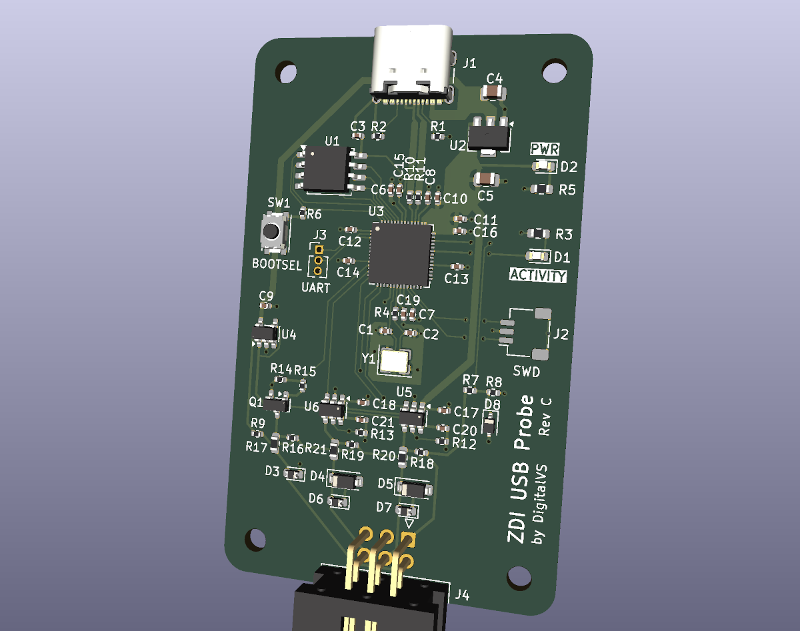
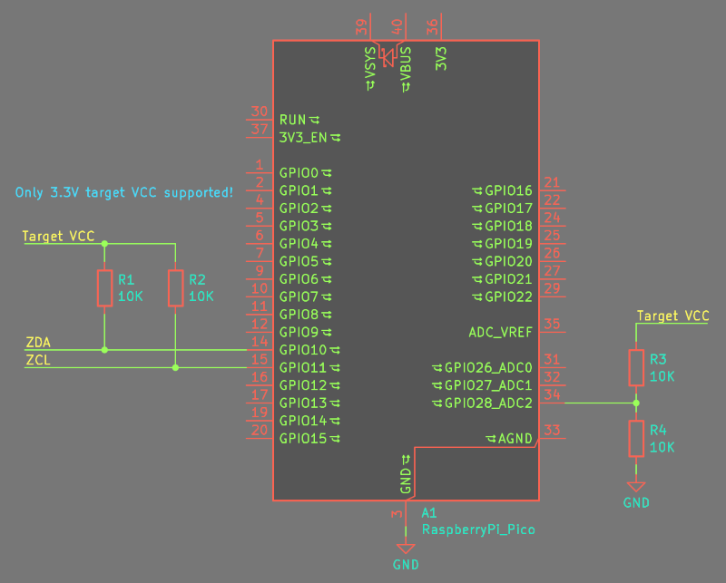

# ZDI-USB-Probe

This project is a Zilog debug interface (ZDI) software and hardware implementation. Software is a command line interface written in Python, and hardware is either RP Pico development board with few additional resistors, or dedicated board (see next picture) which have some advantages in comparison to the RP Pico board.

Target devices are all devices with Zilog eZ80, Z8 and ZNEO MCUs.



## Hardware Description

### Using RP Pico Development Board

Dedicated ZDI USB Probe is based on RP2040 MCU but it's functionality can be used with sole RP Pico board as well. Minimal configuration is shown on the following schematic diagram.



### Using ZDI USB Probe Board

Using dedicated ZDI USB Probe board instead of the RP Pico has numerous advantages:

* Contains six pin ICD connector to connect to the target device, and USB-C on the other side to connect with a PC computer
* Level shifters for ZDA and ZCL lines supporting 1.8V to 5V signal voltages
* Overvoltage protection on a ZDA and ZCL lines and ESD protection on a ZDA, ZCL and reset lines
* Protection for connecting target device VCC to at least 6.5V
* Open drain handling of target device reset signal
* Very small target device power supply load of less than 1mA
* Reliable communication on all ZDI speeds (up to 8MHz)


## Software

ZDI client interface is written in Python language and as a prerequisite needs working Python 3.9+ installation.

Installation is easiest to do with pip command:

```shell
pip install zdi-usb-probe-cli
```

This package is also possible to install from files published in the release section of this repository or to use source files directly without the installation.

### Firmware Update

Latest firmware version is published in the release section of this repository as a UF2 file.

To install a UF2 file on the ZDI USB Probe board, press and hold the BOOTSEL button while plugging the board (or RP Pico) into your computer via a data-capable USB cable. Release the button once a new drive named RPI-RP2 appears. Drag and drop your .uf2 file onto this drive; the Pico will automatically flash, reboot, and unmount.

### ZDI Commands Usage

Command line interface consists of number of commands to read and write data, debug assembly programs and to manage target device state. General command arguments are:

```powershell
> .\zdi -h
usage: zdi [-h] [--version] [-q | -v | -t] {read,write,upload,download,set,break,step,breaks,reg,regs,disassm,run,stop,reset,status,devices} ...

ZDI USB Probe Command Line Interface

positional arguments:
  {read,write,upload,download,set,break,step,breaks,reg,regs,disassm,run,stop,reset,status,devices}
    read                read data from target device
    write               write data to target device
    upload              upload binary file contents to target device
    download            download binary file contents from target device
    set                 set basic parameters (eg. ZDI speed, ADL mode, ICD boot mode)
    break               set or display breakpoint information
    step                single step execution
    breaks              display information for all breakpoints
    reg                 set or display single register value
    regs                display value for all registers
    disassm             disassemble a memory block
    run                 continue execution from the current address
    stop                break on next instruction
    reset               reset the CPU
    status              show status of target device
    devices             list ZDI USB Probe devices

options:
  -h, --help            show this help message and exit
  --version             show program's version number and exit
  -q, --quiet           silence almost all output
  -v, --verbose         allow additional output
  -t, --trace           enable debugging output
```

This part of documentation is a work in progress!
